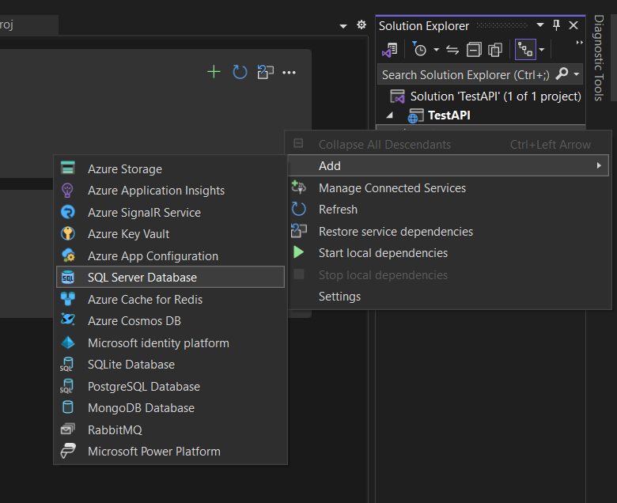
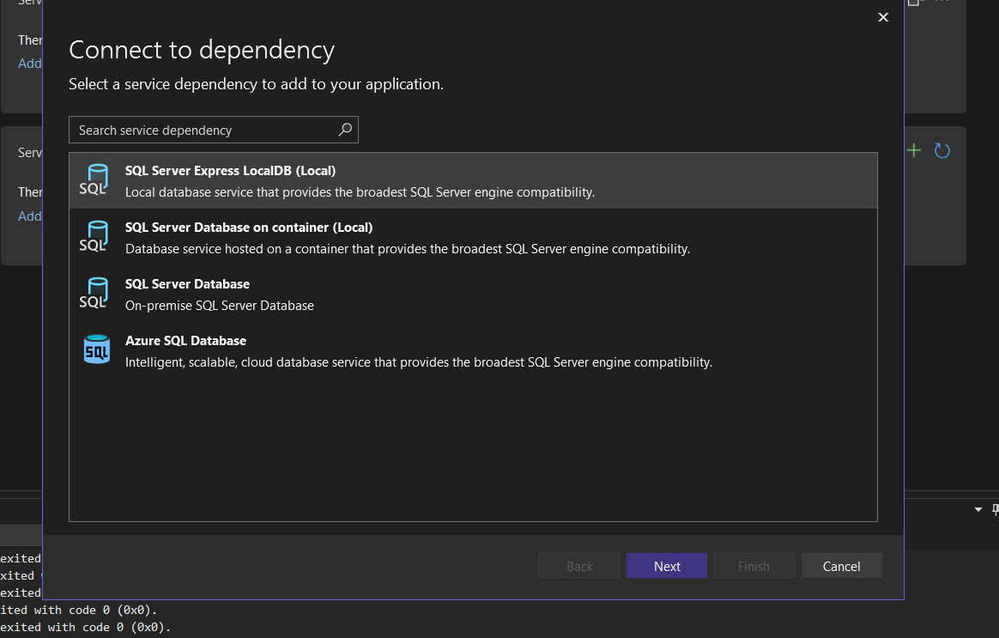
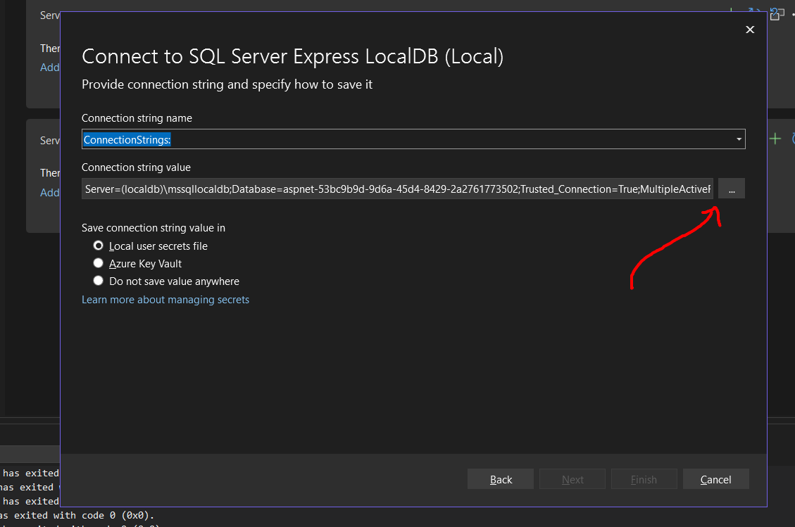
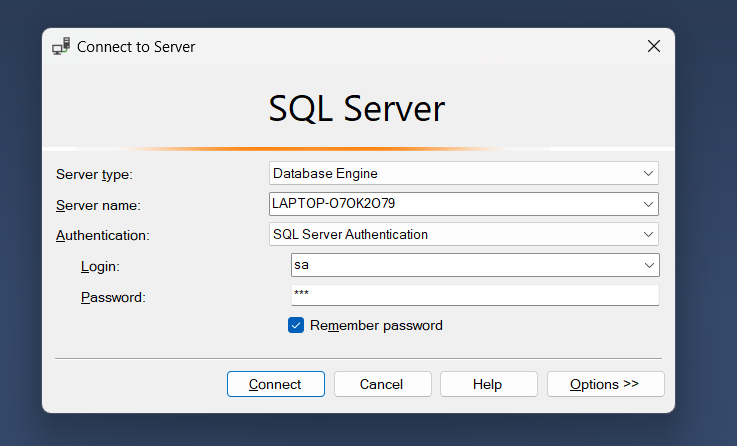
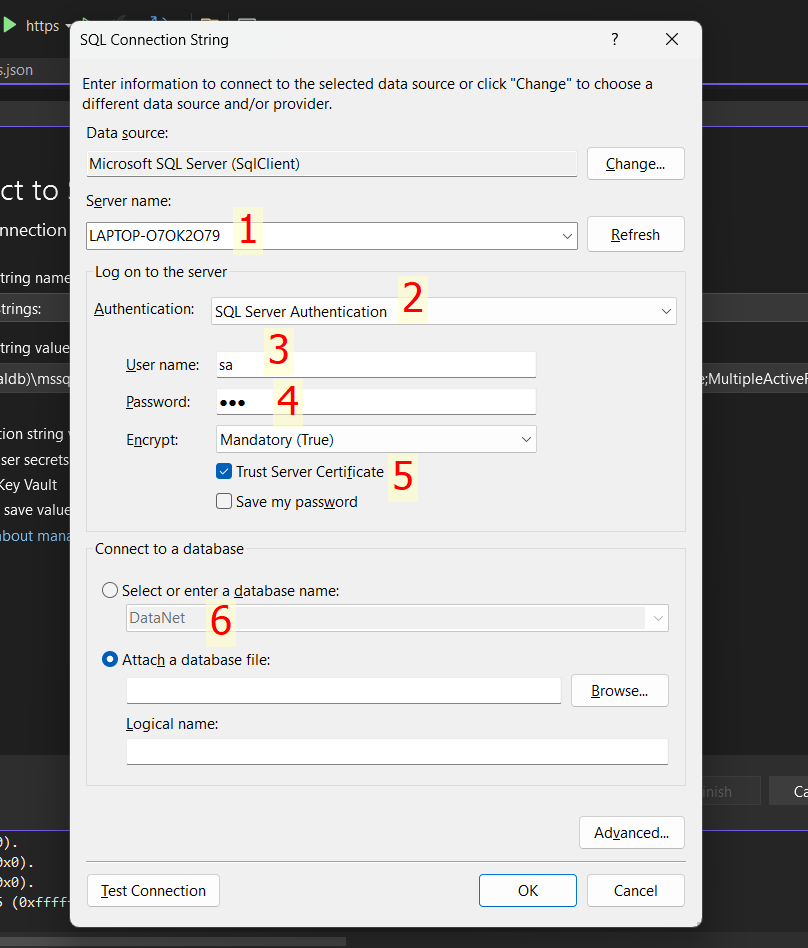
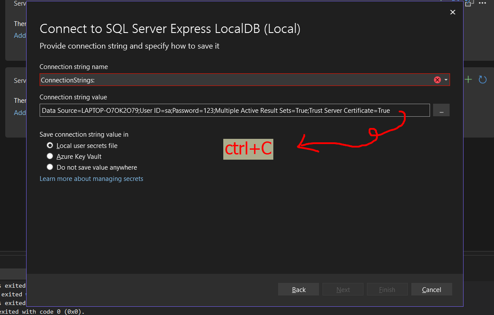
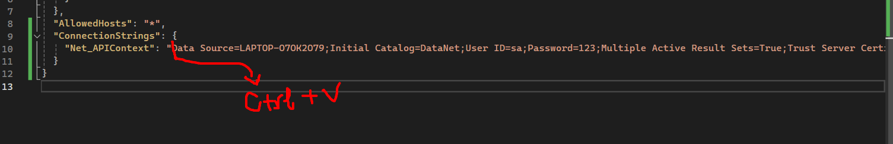
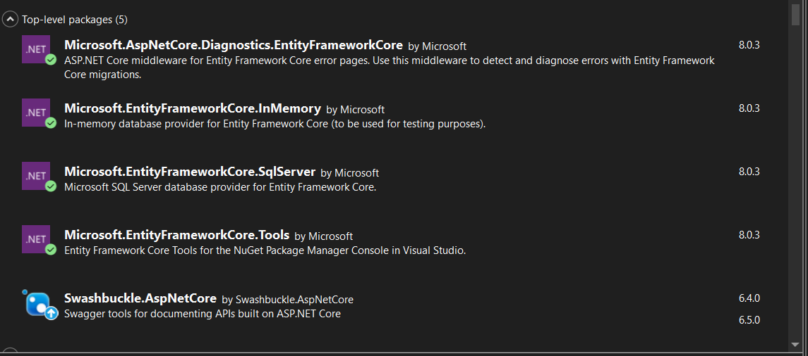
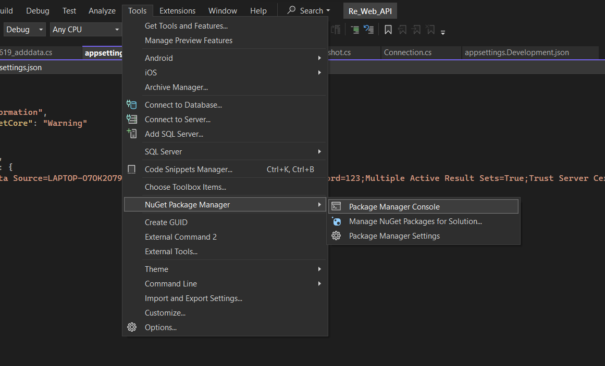
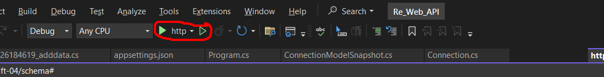

## Getting Stared
Hướng dẫn để khởi chạy dự án 

## Prerequisites
- .Net core 8.0.203
- IDE (Visual Studio bản Enterprise)
    (API.NET and web development and .Netdesktop development -> install while download -> install -> launch) 
- My SQL Server 2022

## Setup
- clone repository (https://github.com/lunacaoz/Project_netcore)
- Khởi động Visual Studio vào open file 
- Khởi động SQL server và làm theo hướng dẫn để cài đặt tài khoản sa : https://www.youtube.com/watch?v=ftVcBoZRAMA
sau đó tạo database " DataNet "
-Tiếp theo vào VisualStudio kick chuộc phải vào file connect service để thực hiện các bước 
    
    
    
    
    
    
    Sau đó vào file appsetting.json thay đường dẫn 
    
    Tiếp theo klick chuộc phải vào Dependencies
    -> chọn Manager Nuget Pakage
    gõ và cài hết tất cả những Framework dưới đây
    
    Sau khi cài tất cả framework thì ta chọn Pakage manager console
     
     gõ lệnh add-migration [tencommit]
     sau khi builsuccess
     gõ tiếp updata-base-> builsuccess
    Sau khi hoàn tất bước cài đặt bấm vài hình đã đánh dấu để chạy thử 
    

